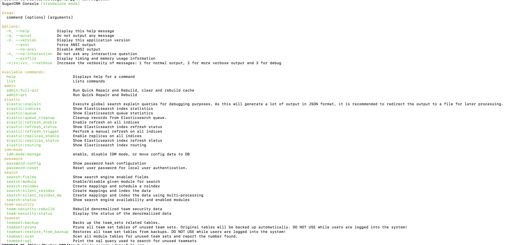

# Sugar Console Developer Tools

A module loadable package which adds developer tools to the SugarCRM Console

## Installation
* Log in to Sugar as an Administrator
* Select the Admin option from the Profile Menu
* Select Module Loader from the Developer Tools 
* Upload the file builds/powerhour_sugar_developers_menu_1.0.0.zip
* Press the Install button 
